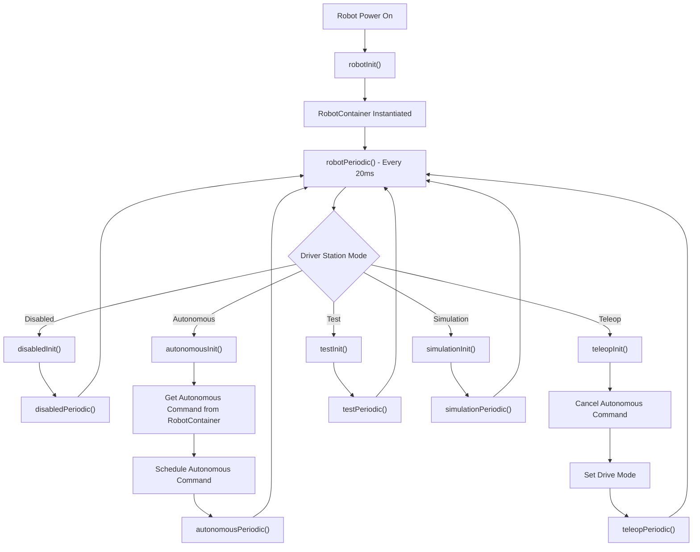

# FRC Robot Code Architecture

This document contains the class diagram for the FRC robot code in the `frc.robot` package.

```mermaid
classDiagram
    class TimedRobot {
        +robotInit()
        +robotPeriodic()
        +autonomousInit()
        +autonomousPeriodic()
        +teleopInit()
        +teleopPeriodic()
        +disabledInit()
        +disabledPeriodic()
        +testInit()
        +testPeriodic()
        +simulationInit()
        +simulationPeriodic()
    }

    class SubsystemBase {
        +periodic()
        +setDefaultCommand(Command)
        +getDefaultCommand()
    }

    class Command {
        +initialize()
        +execute()
        +isFinished()
        +end(boolean)
        +runsWhenDisabled()
    }

    class InstantCommand {
        +initialize()
        +execute()
        +isFinished()
        +end(boolean)
    }

    class ParallelCommandGroup {
        +initialize()
        +execute()
        +isFinished()
        +end(boolean)
    }

    class Robot {
        -RobotContainer m_robotContainer
        -Command m_autonomousCommand
        -Timer disabledTimer
        +robotInit()
        +robotPeriodic()
        +autonomousInit()
        +autonomousPeriodic()
        +teleopInit()
        +teleopPeriodic()
        +disabledInit()
        +disabledPeriodic()
        +testInit()
        +testPeriodic()
        +simulationInit()
        +simulationPeriodic()
    }

    class RobotContainer {
        -SwerveSubsystem drivebase
        -ShooterSubsystem shooter
        -IntakeSubsystem intake
        -LEDSubsystem ledSubsystem
        -SendableChooser autonomousChooser
        -SendableChooser autoChooser
        +configureBindings()
        +getAutonomousCommand()
        +setMotorBrake(boolean)
        +setDriveMode()
    }

    class SwerveSubsystem {
        -SwerveDrive swerveDrive
        -SwerveController controller
        +driveCommand()
        +getPose()
        +resetOdometry()
        +zeroGyro()
    }

    class ShooterSubsystem {
        +runShooterRPM(double)
        +runShooterVoltage(double)
        +stopShooter()
        +getShooterRPM()
    }

    class IntakeSubsystem {
        +runIntakeRollers(double)
        +runIntakeRollersVoltage(double)
        +stopIntakeRollers()
        +setIntakePivot(double)
        +getIntakePivotPosition()
    }

    class LEDSubsystem {
        +setLEDColor(int, int, int)
        +setLEDPattern(String)
    }

    class VisionSubsystem {
        +getTargetData()
        +isTargetVisible()
    }

    class ExampleSubsystem {
        +exampleMethod()
        +exampleMethodCommand()
    }

    class ExampleCommand {
        +initialize()
        +execute()
        +isFinished()
        +end(boolean)
    }

    class AutoShoot {
        +initialize()
        +execute()
        +isFinished()
        +end(boolean)
    }

    class DeployAndRunRollers {
        +initialize()
        +execute()
        +isFinished()
        +end(boolean)
    }

    class IntakePivotToState {
        +initialize()
        +execute()
        +isFinished()
        +end(boolean)
    }

    class RunIntakeRollers {
        +initialize()
        +execute()
        +isFinished()
        +end(boolean)
    }

    class RunIntakeRollersVoltage {
        +initialize()
        +execute()
        +isFinished()
        +end(boolean)
    }

    class RunShooterRPM {
        +initialize()
        +execute()
        +isFinished()
        +end(boolean)
    }

    class RunShooterVoltage {
        +initialize()
        +execute()
        +isFinished()
        +end(boolean)
    }

    class SetIntakeNeutralMode {
        +initialize()
        +execute()
        +isFinished()
        +end(boolean)
    }

    class SetShooterNeutral {
        +initialize()
        +execute()
        +isFinished()
        +end(boolean)
    }

    class Autos {
        +exampleAuto(ExampleSubsystem)
    }

    class LimelightHelpers {
        +getTX(String)
        +getTY(String)
        +getTA(String)
        +getTS(String)
    }

    class Constants {
        +MAX_SPEED
        +DrivebaseConstants
        +OperatorConstants
    }

    class Main {
        +main(String[])
    }

    class Elastic {
        +sendTab(String, Object)
        +sendTabGroup(String, Object[])
    }

    TimedRobot <|-- Robot : extends
    SubsystemBase <|-- SwerveSubsystem : extends
    SubsystemBase <|-- ShooterSubsystem : extends
    SubsystemBase <|-- IntakeSubsystem : extends
    SubsystemBase <|-- LEDSubsystem : extends
    SubsystemBase <|-- VisionSubsystem : extends
    SubsystemBase <|-- ExampleSubsystem : extends

    Command <|-- ExampleCommand : extends
    Command <|-- AutoShoot : extends
    ParallelCommandGroup <|-- DeployAndRunRollers : extends
    Command <|-- IntakePivotToState : extends
    Command <|-- RunIntakeRollers : extends
    Command <|-- RunIntakeRollersVoltage : extends
    Command <|-- RunShooterRPM : extends
    Command <|-- RunShooterVoltage : extends
    InstantCommand <|-- SetIntakeNeutralMode : extends
    InstantCommand <|-- SetShooterNeutral : extends

    Robot --> RobotContainer : has
    RobotContainer --> SwerveSubsystem : has
    RobotContainer --> ShooterSubsystem : has
    RobotContainer --> IntakeSubsystem : has
    RobotContainer --> LEDSubsystem : has

    ExampleCommand --> ExampleSubsystem : uses
    AutoShoot --> ShooterSubsystem : uses
    DeployAndRunRollers --> IntakeSubsystem : uses
    IntakePivotToState --> IntakeSubsystem : uses
    RunIntakeRollers --> IntakeSubsystem : uses
    RunIntakeRollersVoltage --> IntakeSubsystem : uses
    RunShooterRPM --> ShooterSubsystem : uses
    RunShooterVoltage --> ShooterSubsystem : uses
    SetIntakeNeutralMode --> IntakeSubsystem : uses
    SetShooterNeutral --> ShooterSubsystem : uses

    Autos --> ExampleSubsystem : uses
    Autos --> ExampleCommand : uses

    SwerveSubsystem --> VisionSubsystem : uses
    RobotContainer --> VisionSubsystem : uses
```



## Robot.java Execution Flow

This flowchart shows the execution flow of the Robot.java class, focusing on the different modes (Autonomous, Manual/Teleop, Disabled, Test, Simulation).



### Flow Explanation

**Initialization:**
- `robotInit()`: Called once at startup, creates RobotContainer and initializes systems

**Main Loop:**
- `robotPeriodic()`: Runs every 20ms, executes Command Scheduler for all modes

**Autonomous Mode:**
- `autonomousInit()`: Gets and schedules autonomous command from RobotContainer
- `autonomousPeriodic()`: Command Scheduler handles autonomous execution

**Manual (Teleop) Mode:**
- `teleopInit()`: Cancels autonomous commands, sets drive mode for manual control
- `teleopPeriodic()`: Command Scheduler handles driver input and commands

**Other Modes:**
- Disabled: Motor brake control with timer
- Test: Command cancellation and swerve parser initialization
- Simulation: Simulation-specific initialization and periodic functions

## Manual Controller Control Flow

This flowchart shows how manual control works during teleop mode, including controller inputs, button bindings, and command execution.

```mermaid
flowchart TD
    A["Driver Station: Teleop Mode"] --> B["Robot.teleopInit()"]
    B --> C["Cancel Autonomous Commands"]
    C --> D["Set Drive Mode"]
    D --> E["RobotContainer: Manual Control Active"]
    
    E --> F["Driver Controller<br/>Port 0"]
    E --> G["Operator Controller<br/>Port 1"]
    
    F --> H["Left Stick Y<br/>Forward/Backward"]
    F --> I["Left Stick X<br/>Strafe Left/Right"]
    F --> J["Right Stick X<br/>Turn Left/Right"]
    F --> K["Right Bumper<br/>Slow Mode 30%"]
    F --> L["B Button<br/>Auto-Aim Vision"]
    F --> M["Left Bumper<br/>Invert Drive"]
    F --> N["Left Trigger<br/>Invert Turn"]
    F --> O["Back Button<br/>Toggle Slew Rate"]
    F --> P["Y Button<br/>Run Shooter RPM"]
    F --> Q["X Button<br/>Run Intake Rollers"]
    F --> R["A Button<br/>Reverse Intake"]
    F --> S["POV Up/Down<br/>Intake Pivot"]
    F --> T["Right Trigger<br/>Zero Gyro"]
    
    G --> H2["Left Stick Y<br/>Forward/Backward"]
    G --> I2["Left Stick X<br/>Strafe Left/Right"]
    G --> J2["Right Stick X<br/>Turn Left/Right"]
    G --> K2["Right Bumper<br/>Slow Mode 30%"]
    G --> L2["B Button<br/>Auto-Aim Vision"]
    G --> M2["Left Bumper<br/>Invert Drive"]
    G --> N2["Left Trigger<br/>Invert Turn"]
    G --> O2["Back Button<br/>Toggle Slew Rate"]
    G --> P2["Y Button<br/>Run Shooter RPM"]
    G --> Q2["X Button<br/>Run Intake Rollers"]
    G --> R2["A Button<br/>Reverse Intake"]
    G --> S2["POV Up/Down<br/>Intake Pivot"]
    G --> T2["Right Trigger<br/>Zero Gyro"]
    
    H --> U["Drive Command<br/>Translation X"]
    I --> U
    J --> U
    K --> U
    L --> U
    M --> U
    N --> U
    O --> U
    
    H2 --> U
    I2 --> U
    J2 --> U
    K2 --> U
    L2 --> U
    M2 --> U
    N2 --> U
    O2 --> U
    
    U --> V["SwerveSubsystem<br/>driveCommand()"]
    V --> W["Field Centric Drive<br/>or Robot Centric"]
    
    P --> X["RunShooterRPM<br/>Command"]
    P2 --> X
    X --> Y["ShooterSubsystem"]
    
    Q --> Z["RunIntakeRollersVoltage<br/>Command"]
    Q2 --> Z
    Z --> AA["IntakeSubsystem"]
    
    R --> BB["Reverse Intake<br/>Command"]
    R2 --> BB
    BB --> AA
    
    S --> CC["IntakePivotToState<br/>Command"]
    S2 --> CC
    CC --> AA
    
    T --> DD["Zero Gyro<br/>Command"]
    T2 --> DD
    DD --> V
    
    W --> EE["Robot Movement<br/>Manual Control"]
    Y --> FF["Shooter Control<br/>Manual RPM"]
    AA --> GG["Intake Control<br/>Manual Operation"]
    
    EE --> HH["robotPeriodic()<br/>Command Scheduler"]
    FF --> HH
    GG --> HH
```



### Manual Control Overview

**Driver Controller (Port 0) & Operator Controller (Port 1):**
- **Both controllers have identical button mappings** for redundancy
- **Drive controls** use left stick (forward/back, strafe) and right stick (turn)
- **Subsystem controls** for shooter, intake, and drive functions
- **Modifier buttons** for slow mode, drive inversion, and settings toggles

**Key Features:**
- **Dual Controller Support**: Both driver and operator can control all functions
- **Slow Mode**: Right bumper on either controller reduces speed to 30%
- **Vision Integration**: B button enables Limelight auto-aiming
- **Drive Customization**: Buttons to invert drive direction, turn direction, and toggle slew rate limiting
- **Subsystem Commands**: Direct control of shooter RPM, intake rollers, and intake pivot

**Command Flow:**
1. Driver Station switches to Teleop mode
2. `Robot.teleopInit()` cancels autonomous and sets manual mode
3. Controller inputs are processed every 20ms in `robotPeriodic()`
4. Command Scheduler executes button-bound commands and drive control
5. Subsystems respond to manual commands

## Autonomous vs Manual Control Comparison

### **The Problem Identified**

**Manual Control (Teleop):**
- ✅ Default drive command active with controller input lambdas
- ✅ Processes joystick inputs → velocity commands → swerve drive
- ✅ Works perfectly for manual driving

**Autonomous Control:**
- ❌ Default drive command still running (reading zero controller inputs)
- ❌ PathPlanner commands trying to drive simultaneously
- ❌ **CONFLICT**: Zero velocities from default command vs autonomous path velocities
- ❌ Robot doesn't move or moves erratically

### **The Fix Applied**

**Modified `Robot.autonomousInit()`:**
```java
// CRITICAL FIX: Cancel the default drive command to prevent conflicts
if (m_robotContainer.getDrivebase() != null) {
  m_robotContainer.getDrivebase().removeDefaultCommand();
}
```

**Modified `Robot.teleopInit()`:**
```java
// CRITICAL FIX: Restore the default drive command for manual control
m_robotContainer.restoreDefaultDriveCommand();
```

**Result:**
- ✅ Autonomous: Default command removed, PathPlanner drives exclusively
- ✅ Teleop: Default command restored, manual control works perfectly
- ✅ No more conflicting drive commands

### **Why This Happens**

The default drive command (set in RobotContainer constructor) runs continuously and reads controller inputs. During autonomous, controllers aren't touched (inputs = 0), but the command still sends zero velocities to the drive system, conflicting with autonomous path following commands.

## Overview

This diagram represents the WPILib command-based robot architecture for the FRC robot code:

- **Robot**: Main robot class extending `TimedRobot`
- **RobotContainer**: Container class managing subsystems and commands
- **Subsystems**: Hardware control classes extending `SubsystemBase`
- **Commands**: Action classes extending `Command` or its variants
- **Utilities**: Helper classes like `LimelightHelpers`, `Constants`, etc.

The diagram shows inheritance relationships (using `<|--`) and composition/usage relationships (using `-->`) between the classes.